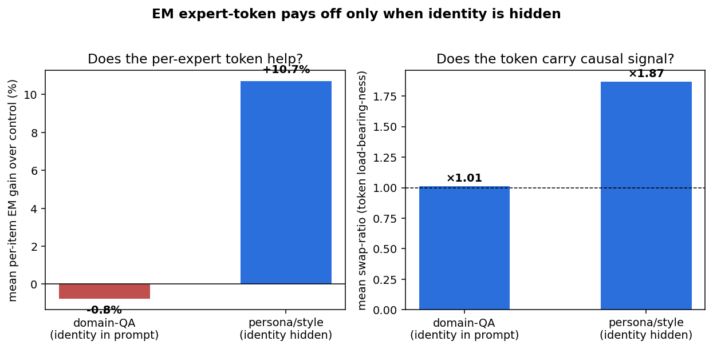
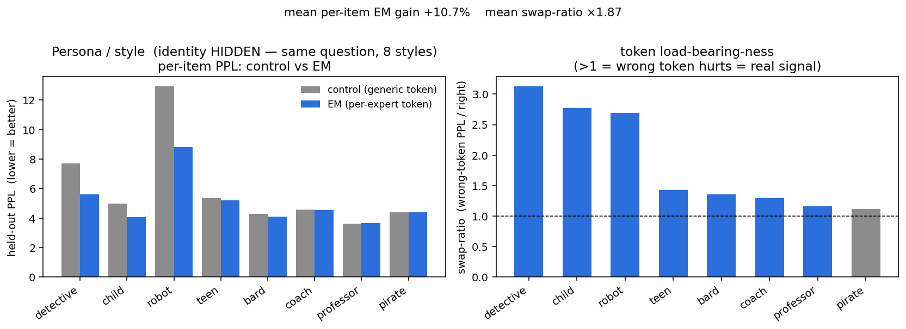
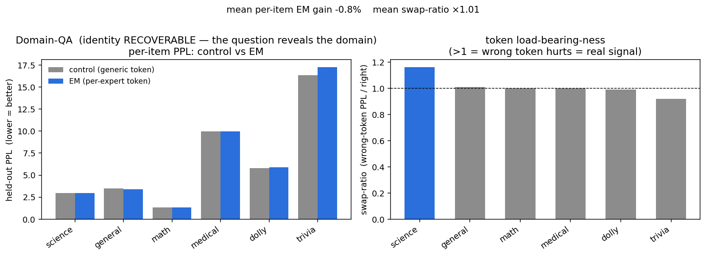
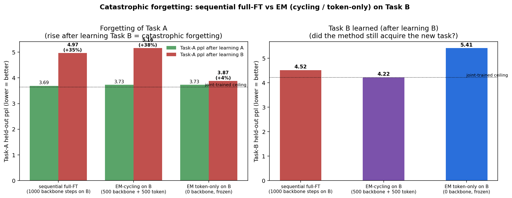

# EM Expert-Token Finetuning — Consolidated Report

**The question.** The master thesis (`papers/master_thesis_stream_a.pdf`) proposes conditioning a *single
shared backbone* on a bank of **learned per-expert token embeddings**, trained via an **EM-style two-phase
protocol** — Phase A trains the backbone with the tokens frozen, Phase B freezes the backbone and fits only
the token embeddings. This report consolidates everything we found about **when, why, and how much that
helps** — versus naive joint finetuning, a generic-token baseline, and a real Mixture-of-Experts.

> **TL;DR.** The expert token is a **cheap conditioning handle** on a shared backbone. It is *redundant* when
> the task identity is recoverable from the input (domain-QA), and **decisive** when the identity is hidden
> and determines the output (persona/style, conflicting knowledge). Its biggest practical wins are exactly
> where the thesis predicts: **imbalanced / low-data regimes** (cold-start), **embedding distinctness** (no
> collapse), and **continual learning without catastrophic forgetting**. The EM *two-phase ceremony* matters
> for quality/regularisation and for the scarce-data tail — but on balanced, ample data a per-expert token
> trained by plain SFT already captures most of the benefit.

🖼️ **In a hurry?** [SUMMARY.md](SUMMARY.md) shows every core result as one line + its graphic.

📋 **Apparatus** — models, datasets, hyperparameters, data formats and real data examples (incl. the
*conflicting vs. expected knowledge* distinction) are documented in
**[EXPERIMENTAL_SETUP.md](EXPERIMENTAL_SETUP.md)**.

This directory has three bodies of work:

| directory | what | scale |
|---|---|---|
| [`comparison/`](comparison/) | the original **capacity** headline: EM-token vs real MoE vs full-FT | byte-level d=256, 8 domains |
| [`em-expert-tokens/`](em-expert-tokens/) | the **mechanism, robustness & fidelity** study (persona, knowledge, cold-start, collapse, forgetting) | Qwen2.5-0.5B / 3B |
| [`convergence/`](convergence/) | **training dynamics** (convergence speed, Phase-A/B split, cycling) | Qwen2.5-0.5B / 3B |

---

## 1. When does the expert token help? — one clean principle

Across four settings the rule is sharp: **the expert token pays off exactly when the task identity is (a) not
recoverable from the input *and* (b) determines the output.** Novelty of knowledge alone is not enough.



| setting | identity in the prompt? | EM vs generic | token load-bearing (swap) | detail |
|---|---|---|---|---|
| domain-QA (6 generative domains) | **yes** (question reveals domain) | tied (−0.8%) | no (~1.0) | [DOMAIN_RESULTS](em-expert-tokens/DOMAIN_RESULTS.md) |
| novel knowledge, **recoverable** (PopQA long-tail) | **yes** (subject in question) | tied (−1/+2 pts) | no (~0) | [KNOWLEDGE_RESULTS](em-expert-tokens/KNOWLEDGE_RESULTS.md) |
| **persona / style** (hidden identity) | **no** (same question, 8 styles) | **+10.7%** | **yes (1.87)** | [PERSONA_RESULTS](em-expert-tokens/PERSONA_RESULTS.md) |
| **novel knowledge, conflicting** (CounterFact) | **no** (source only in the token) | **+50 pts (2×)** | **yes (swap → 0%)** | [KNOWLEDGE_RESULTS](em-expert-tokens/KNOWLEDGE_RESULTS.md) |

- **Persona/style** — the thesis's home turf. Eight personas answer the *same* held-out questions; the identity
  is hidden, so a generic token must average across styles. The per-persona token conditions cleanly:
  **+10.7%** perplexity, and a swap-test shows it carries real, non-redundant signal (routing through the wrong
  persona costs up to 3×).

  

- **Conflicting knowledge** — the most extreme case. Same prompt, two answers (real vs counterfactual world),
  source given *only* by the token. A generic token is pinned at the **50% coin-flip ceiling**; the per-world
  token **doubles accuracy to ~100%**, and the swap-test collapses to 0% — the token carries the entire
  source→answer mapping. Facts the model provably lacks (base acc 4–6%).

  

- **Domain-QA / recoverable knowledge** — the token is redundant: the question already reveals which
  domain/fact, so a generic marker does just as well. *(This holds even for genuinely novel facts — novelty is
  not the deciding factor; recoverability is.)*

  

## 2. Is the EM *two-phase* protocol worth it, or is it just the token?

Separating "the token" from "the EM ceremony":

- **For knowledge routing, plain joint SFT with the token = EM two-phase, to the decimal.** Adding a per-source
  token to ordinary SFT already breaks the ceiling (99.7%); the decoupled Phase-A/Phase-B protocol adds nothing
  on top. What matters is *having the token*, not the alternation. ([KNOWLEDGE_RESULTS](em-expert-tokens/KNOWLEDGE_RESULTS.md))
- **For persona quality, the EM decoupling helps modestly** — at matched compute, two-phase EM beats straight
  joint SFT by **+8.8%** ppl, and produces a better backbone (though a *less* load-bearing token). ([PERSONA_RESULTS](em-expert-tokens/PERSONA_RESULTS.md))
- **The decisive EM win is data-dependent** (§4): on scarce/imbalanced data the two phases matter a lot; on
  balanced ample data they mostly don't.
- **Directly confirmed** ([EM_VS_SFT.md](em-expert-tokens/EM_VS_SFT.md)): with **many personas (K=64) and few
  episodes each**, EM two-phase's advantage over joint SFT **grows as episodes-per-persona shrink** — tied at
  n=40, **+7% at n=15, +19% at n=5** — and at low data the *learned* token beats a *frozen-random* one by
  +10–12% (whereas on ample data they tie). So the earlier "frozen-random works just as well" observation is a
  balanced-data artifact: **learning the embedding, and the two-phase scheme, earn their keep precisely in the
  data-starved-per-expert long tail** the thesis targets.

## 3. Training dynamics — convergence, budget split, cycling

Full detail in [convergence/CONVERGENCE_RESULTS.md](convergence/CONVERGENCE_RESULTS.md).


- **The token helps at every step count.** On conflicting knowledge, generic SFT converges to a *wall* (ppl
  floors ~1.4 = the 50% ceiling); the token drives ppl → 1.0. Persona (on a properly-sized set) converges
  cleanly to a plateau with the token arms below generic throughout.
- **Best Phase-A/B split = all Phase-A** on *both* tasks (given balanced data): the backbone does the work; a
  token-only Phase B can't compensate for an under-trained backbone. *(An earlier "persona prefers Phase-B"
  result was an overfitting artifact of a too-small dataset — corrected.)*
- **Cycling (alternating A⇄B) is a second-order knob.** It converges **slower per step** (Phase-B steps barely
  move a backbone objective) and its main value is **regularisation** against overfitting, not speed. A 2D
  sweep shows accuracy ≈ f(total compute), provided each phase keeps ≥~250 steps.

  [`split_ratios.png`](convergence/split_ratios.png) · [`cycles.png`](convergence/cycles.png) ·
  [`cycle_sweep_2d.png`](convergence/cycle_sweep_2d.png) · [`cycle_trajectory.png`](convergence/cycle_trajectory.png)

## 4. Where EM decisively wins — robustness

These are the strongest, most practical advantages, and they match the thesis's stated motivations.

### 4a. Cold-start / imbalanced data — the thesis's core claim, reproduced

With wildly imbalanced train volumes (450 → 4 examples) and a balanced test, **EM two-phase crushes naive
joint SFT: −38% MACRO ppl, winning on every persona** — the *opposite* of the balanced-data regime. The most
data-starved persona (4 examples) is rescued **43.0 → 8.5 ppl**, and *more Phase-B budget rescues it more*.
This is exactly the thesis's mechanism: Phase B fits a starved embedding against a frozen, capable backbone.
([COLDSTART_RESULTS](em-expert-tokens/COLDSTART_RESULTS.md))


### 4b. Embedding collapse (thesis's 2nd primary metric)

EM keeps the persona embeddings **far more distinct** than joint SFT — mean pairwise cosine **0.23 → 0.06**,
L2 separation **~10×**, monotonic in Phase-B budget. The alternating protocol resists the collapse the thesis
warns about. ([COLLAPSE_RESULTS](em-expert-tokens/COLLAPSE_RESULTS.md))


### 4c. Continual learning — catastrophic forgetting

Learn Task A, then Task B. **Naive sequential full-FT catastrophically forgets A (+35% ppl).** The
expert-token framework offers *parameter isolation* — learn the new task as a **new token on a frozen
backbone** — which cuts forgetting to **+4%**. Cycling on the new task learns it best (matches the joint
ceiling) but forgets as much as full-FT — so the anti-forgetting benefit comes specifically from *freezing the
backbone*, a retention/plasticity trade-off. ([CATASTROPHIC_FORGETTING](em-expert-tokens/CATASTROPHIC_FORGETTING.md))



## 5. The capacity comparison — EM vs a real MoE (original headline)

At byte-level d=256 on 8 domains ([comparison/](comparison/)), with matched compute:

| method | macro-ppl ↓ | +params over dense | routing-acc | swap-ratio (specialization) |
|---|---|---|---|---|
| dense (full-FT) | 2.965 | 0 | 0.56 | — |
| **EM-governance** | 2.894 | **+2,048** | **1.00** | **1.62** |
| EM-prefix | 2.940 | +2,048 | 1.00 | 1.53 |
| MoE (16 experts, top-2) | **2.660** | +23.7M (~3× total) | 0.56 | — |

**The MoE wins on raw perplexity but costs ~3× the parameters; the EM token buys near-free specialization** —
perfect routing (acc 1.0) and real, causal per-domain behaviour (swap 1.6) that *neither* the dense model nor
the MoE has — at **+2,048 parameters**. Mechanistic-interpretability confirms the tokens steer a genuine FFN
subspace ([comparison/mech_interp/](comparison/mech_interp/)). So EM and MoE buy *different* things: MoE buys
capacity, EM buys cheap conditioning/specialization.

## 6. The advantages of EM training — synthesis

Pulling it all together, what does EM expert-token training actually buy?

1. **Near-free specialization on a shared backbone.** A handful of learned token embeddings (+2K params) give
   perfect domain routing and causal per-expert behaviour a dense model lacks — at a tiny fraction of a MoE's
   parameter cost (§5).
2. **It helps precisely when it should.** The token is load-bearing exactly when identity is hidden and
   outcome-determining (persona +10.7%, conflicting knowledge 2×), and gracefully redundant otherwise (§1) —
   so it never *hurts*, and it shines in the settings the thesis targets.
3. **Robustness to data scarcity — the killer app.** Under realistic data imbalance, EM beats naive SFT by
   ~38% and rescues cold-start experts (43→8.5 ppl). This is where the two-phase decoupling is *essential*, not
   optional (§4a) — Phase B fits starved embeddings against a frozen, capable backbone.
4. **Distinct, collapse-resistant representations.** EM embeddings stay ~10× more separated than joint SFT's,
   satisfying the thesis's anti-collapse criterion (§4b).
5. **A path to continual learning.** Per-task tokens on a frozen backbone give parameter isolation → +4% vs
   +35% forgetting when adding a new task (§4c).
6. **Efficiency & modularity.** Adding an expert = adding a token (a few KB), not retraining or a new FFN.
   Experts can be added, swapped, or frozen independently.

**And the honest limits:**

- On **balanced, data-rich** tasks the two-phase ceremony adds little over plain SFT-with-a-token; *the token*
  is the active ingredient, the *alternation* is a refinement (§2, §3).
- The token **cannot add capacity or store new facts by itself** — knowledge lives in the backbone; a
  token-only phase can route and stylize but not memorize (§3, §4c).
- When identity is **recoverable from the input**, the token is redundant (§1).
- **Cycling trades convergence speed for regularisation** — not a free lunch (§3).

**Bottom line.** EM expert-token finetuning is a **cheap, modular conditioning mechanism** that is most
valuable in exactly the regimes the thesis cares about — hidden per-expert identity, scarce/imbalanced
per-expert data, collapse avoidance, and continual learning — while a real MoE remains the tool when you need
raw *capacity*.

## 7. Fidelity to the thesis

[em-expert-tokens/THESIS_FIDELITY.md](em-expert-tokens/THESIS_FIDELITY.md): the core representation (learned
per-speaker token embeddings, two-phase EM, naive-joint-SFT & generic baselines) and **both** primary metrics
(held-out-ppl-vs-generic, embedding collapse) are faithfully implemented, and the central cold-start claim
reproduces. Remaining gaps: Phase-B **noise injection** and **phase-ordering** (both cheap, not yet run).

## Directory map

```
reports/
  README.md                     ← this consolidated report
  EXPERIMENTAL_SETUP.md         ← models, datasets, hyperparameters, data formats + examples
  em-expert-tokens/             ← Qwen mechanism / robustness / fidelity study
    README.md                     setup + local index
    PERSONA_RESULTS.md            §1 persona (hidden identity)
    DOMAIN_RESULTS.md             §1 domain-QA (recoverable, null)
    KNOWLEDGE_RESULTS.md          §1 novel knowledge (recoverable vs conflicting)
    RESULTS.md                    §1 appendix: domain-count sweep + metric post-mortem
    EM_VS_SFT.md                  §2 many-personas × few-episodes: where EM beats joint SFT
    COLDSTART_RESULTS.md          §4a imbalanced / cold-start
    COLLAPSE_RESULTS.md           §4b embedding collapse metric
    CATASTROPHIC_FORGETTING.md    §4c continual learning
    THESIS_FIDELITY.md            §7 fidelity check
    figs/                         all figures + their JSON data
    repro/                        all training / eval / figure / data scripts + sbatch
  convergence/                  ← §3 training dynamics (curves, split, cycling)
  comparison/                   ← §5 d256 EM-vs-MoE-vs-full-FT capacity headline + mech-interp
```

Every figure is reproducible from the scripts in `em-expert-tokens/repro/` (and `convergence/make_conv_figs.py`)
over the JSON data checked in beside them.
