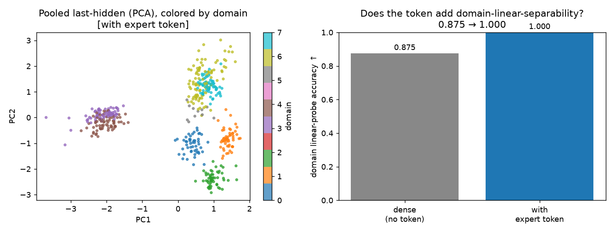

# Visual Summary — EM Expert-Token Finetuning

Every core result at a glance: one line of *setup → result*, then the graphic. Full write-ups in
[README.md](README.md); apparatus in [EXPERIMENTAL_SETUP.md](EXPERIMENTAL_SETUP.md).

---

### 1. The principle — when does the expert token help?
Four settings (domain-QA, recoverable knowledge, persona, conflicting knowledge): **the token helps iff the
task identity is *hidden from the input* AND *determines the output*** — recoverability, not novelty, decides.
*([README §1](README.md#1-when-does-the-expert-token-help--one-clean-principle))*

### 2. Persona / style (the thesis's setting)
8 personas answer the *same* held-out questions in different styles (identity hidden) → a per-persona token
beats a generic one by **+10.7%** ppl, with a load-bearing swap-ratio of **1.87** (wrong persona → up to 3×).
*([PERSONA_RESULTS](em-expert-tokens/PERSONA_RESULTS.md))*

### 3. Novel knowledge — conflicting vs recoverable
Facts the model provably lacks (base acc 4–6%): when the source lives *only* in the token (**conflicting**)
it **doubles accuracy** (50% coin-flip ceiling → ~100%, swap → 0%); when recoverable from the question it is
**redundant**. *([KNOWLEDGE_RESULTS](em-expert-tokens/KNOWLEDGE_RESULTS.md))*

### 4. When does EM two-phase beat *standard* SFT? — many personas × few episodes
64 personas at varying episodes each (Qwen2.5-3B): EM's edge over joint SFT **grows as episodes-per-persona
shrink** — tied at 40, **+7% at 15, +19% at 5** — and learned tokens beat *frozen-random* ones only at low
data. *([EM_VS_SFT](em-expert-tokens/EM_VS_SFT.md))*

### 5. Cold-start / imbalanced data (thesis's core claim)
Persona train volumes **450 → 4** examples, balanced test: EM **crushes joint SFT (−38%** ppl), rescuing the
4-example persona **43 → 8.5** — Phase B fits starved embeddings against a capable frozen backbone.
*([COLDSTART_RESULTS](em-expert-tokens/COLDSTART_RESULTS.md))*

### 6. Embedding collapse (thesis's 2nd metric)
Geometry of the learned tokens: EM keeps them **~10× more separated** than joint SFT (mean cosine
**0.23 → 0.06**), monotonic in Phase-B budget — resisting the collapse the thesis warns about.
*([COLLAPSE_RESULTS](em-expert-tokens/COLLAPSE_RESULTS.md))*

### 7. Catastrophic forgetting (continual learning)
Learn Task A → Task B: sequential full-FT **forgets A (+35%)**; adding B as a **new token on a frozen
backbone** cuts forgetting to **+4%** (parameter isolation) — while cycling learns B best but forgets.
*([CATASTROPHIC_FORGETTING](em-expert-tokens/CATASTROPHIC_FORGETTING.md))*

### 8. Convergence speed
Held-out metric vs training steps: the token helps at **every** step; generic SFT plateaus at the coin-flip
*wall* on conflicting knowledge while the token drives ppl → 1.0, and persona converges cleanly.
*([CONVERGENCE_RESULTS §1](convergence/CONVERGENCE_RESULTS.md))*

### 9. Does alternating cycle *faster or slower*?
Trajectory of joint SFT vs continuous backbone vs cycling-EM: cycling is **slower per step** (Phase-B steps
are ~flat) with no upside on knowledge, but **resists late overfitting** on persona.
*([CONVERGENCE_RESULTS §5](convergence/CONVERGENCE_RESULTS.md#5-does-alternating-converge-faster-or-slower-trajectory))*

### 10. EM vs a real MoE — near-free specialization (mechanistic)
d256 byte-level, 8 domains: the expert token steers a **genuine latent subspace** (token-on vs -off), giving
per-domain specialization the dense model lacks — at **+2,048 params** vs the MoE's ~3× parameter cost.
*([README §5](README.md#5-the-capacity-comparison--em-vs-a-real-moe-original-headline), [mech-interp](comparison/mech_interp/report.md))*

---

## More graphics (supporting detail)

- **Domain-QA null** — the token is redundant when the domain is recoverable: [em-expert-tokens/figs/domain_results.png](em-expert-tokens/figs/domain_results.png) *([DOMAIN_RESULTS](em-expert-tokens/DOMAIN_RESULTS.md))*
- **Phase A/B split sweep** — all-Phase-A is best on both tasks: [convergence/split_ratios.png](convergence/split_ratios.png), [convergence/split_sweep.png](convergence/split_sweep.png) *([CONVERGENCE §2](convergence/CONVERGENCE_RESULTS.md))*
- **Multi-cycle EM** — cycle count is second-order: [convergence/cycles.png](convergence/cycles.png) *([CONVERGENCE §3](convergence/CONVERGENCE_RESULTS.md))*
- **2D sweep (cycles × steps/phase)** — accuracy ≈ f(total compute): [convergence/cycle_sweep_2d.png](convergence/cycle_sweep_2d.png) *([CONVERGENCE §4](convergence/CONVERGENCE_RESULTS.md))*
- **EM cycling schematic** — the alternating protocol illustrated: [convergence/em_cycling_schematic.png](convergence/em_cycling_schematic.png)
- **Mech-interp: activation shift** — token-on vs -off FFN activation: [comparison/mech_interp/1_activation_shift.png](comparison/mech_interp/1_activation_shift.png)
- **Mech-interp: gate signatures** — per-expert gating: [comparison/mech_interp/2_gate_signatures.png](comparison/mech_interp/2_gate_signatures.png)
