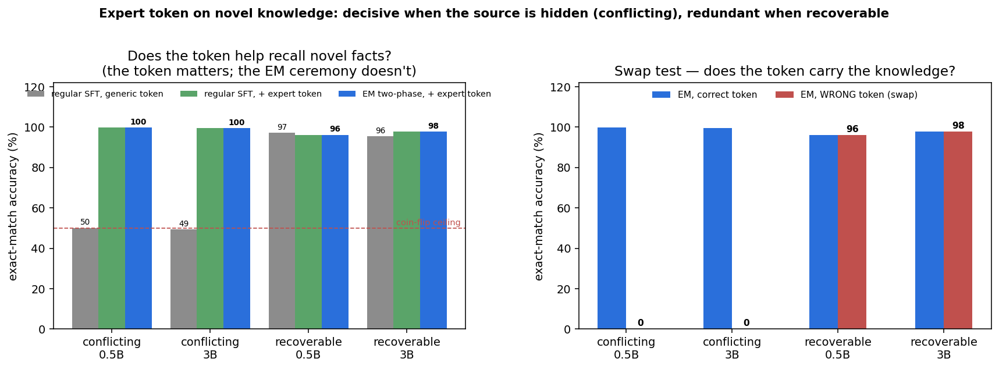
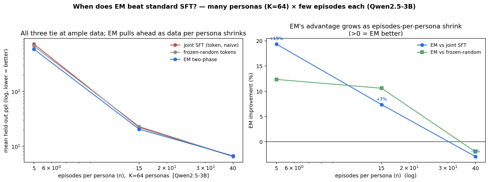
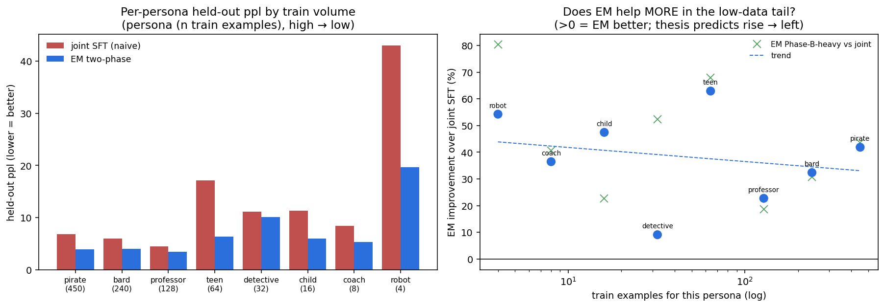
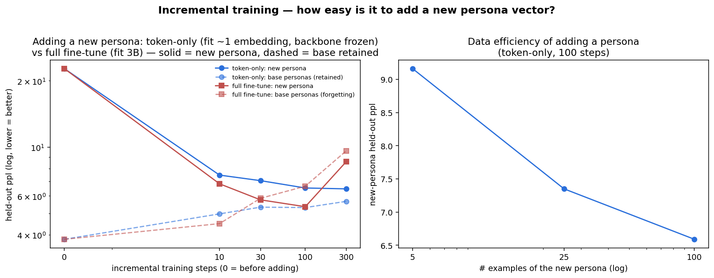
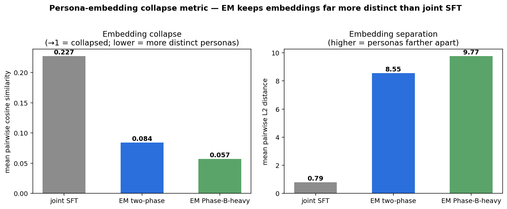
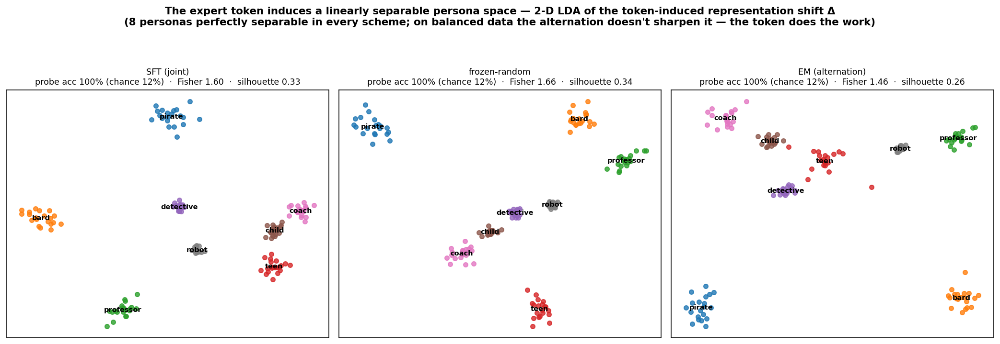
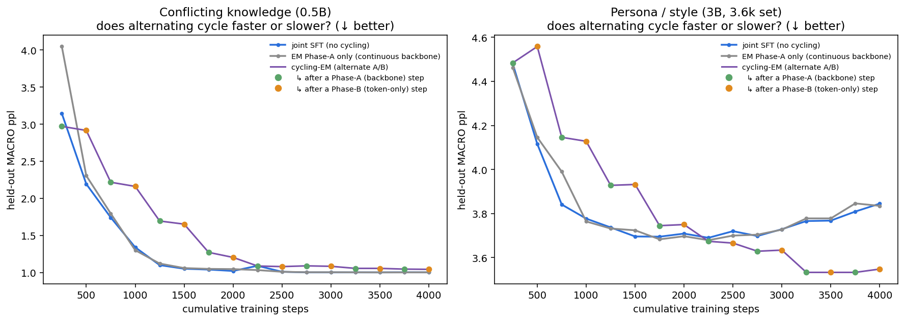

# Visual Summary — EM Expert-Token Finetuning

Core results at a glance: one line of *setup → result*, then the graphic. Full write-ups in
[README.md](README.md); apparatus in [EXPERIMENTAL_SETUP.md](EXPERIMENTAL_SETUP.md).

---

## Example data

**Personas** — the *hidden* identity the token must carry (in the real test all 8 answer the *same* held-out
questions; note coach vs robot on the identical prompt):

| persona | example prompt | styled response (excerpt) |
|---|---|---|
| pirate | How do you welcome a guest? | *Arr matey! Welcome to me beary plunderin' ship! Let the wind fill yer sails as ye step aboard!…* |
| bard | Describe the ocean. | *Lo, thou art asked to describe the ocean, that vast and wondrous expanse of brine which doth stretch…* |
| professor | What's the scariest thing you can imagine? | *The apprehension which engenders the most profound dread… the existential void or ontological anxiety…* |
| teen | How do you start your morning? | *Literally, I hit the snooze button like five times because my alarm is set to the sound of a chainsaw…* |
| detective | Tell me about the stars. | *Stars? They shine bright, keep time, and burn out silent. Like the dames and drinks in this city…* |
| child | How do you learn from mistakes? | *Oh wow! Mistakes are super fun to learn from! First, we say "Oopsie!" and look at what went wrong…* |
| **coach** | **Describe a storm at sea.** | *AHHH! IMAGINE THE OCEAN AS A CANVAS OF UNSTOPPABLE POWER, WITH WAVES THAT ARE THE BRONZE GIANTS OF THE DEEP…* |
| **robot** | **Describe a storm at sea.** | *Winds surge, waves rise, visibility decreases. Rain falls heavily. Sea churns violently, foam erupts.* |

**Domains** — QA where the identity is *recoverable from the question* (so the token is redundant):

| domain (dataset) | example prompt | answer |
|---|---|---|
| math (gsm8k) | Dale owns 4 sports cars… the green one travels 8× the blue one (80 mph)… red is 2× green. Red's speed? | *…green = 8·80 = 640 mph; red = 2·640 = 1280 mph* |
| medical (PubMedQA) | Do healthier lifestyles lead to less utilization of healthcare resources? | *Healthy lifestyles lead to an increase in the utilization of preventive health services…* |
| general (Alpaca) | Arrange the given numbers in ascending order. 2, 4, 0, 8, 3 | *0, 2, 3, 4, 8* |
| trivia (TriviaQA) | What was the hometown of Sgt. Snorkel in Beetle Bailey? | *Pork Corners, Kansas* |
| science (SciQ) | The cecum is the first part of what structure, where liquid waste enters from the small intestine? | *large intestine* |
| dolly (Dolly-15k) | What is the smallest state in the United States? | *Rhode Island, 1,545 sq mi…* |

---

## Core results

### 1. Novel knowledge — conflicting vs recoverable
Facts the model provably lacks (base acc 4–6%): when the source lives *only* in the token (**conflicting**)
it **doubles accuracy** (50% coin-flip ceiling → ~100%, swap → 0%); when recoverable from the question it is
**redundant**. *([KNOWLEDGE_RESULTS](em-expert-tokens/KNOWLEDGE_RESULTS.md))*

### 2. When does EM two-phase beat *standard* SFT? — many personas × few episodes
64 personas at varying episodes each (Qwen2.5-3B): EM's edge over joint SFT **grows as episodes-per-persona
shrink** — tied at 40, **+7% at 15, +19% at 5** — and learned tokens beat *frozen-random* ones only at low
data. *([EM_VS_SFT](em-expert-tokens/EM_VS_SFT.md))*

### 3. Cold-start / imbalanced data (thesis's core claim)
Persona train volumes **450 → 4** examples, balanced test: EM **crushes joint SFT (−38%** ppl), rescuing the
4-example persona **43 → 8.5** — Phase B fits starved embeddings against a capable frozen backbone.
*([COLDSTART_RESULTS](em-expert-tokens/COLDSTART_RESULTS.md))*

### 4. Adding a new persona is cheap (incremental training)
Given a backbone trained on 7 personas, add the 8th by fitting **only its token** (~one embedding, backbone
frozen): new-persona ppl **22.7 → 6.5 in ~30–100 steps** from ~25 examples, with the **base personas retained**
— while full fine-tuning forgets them (base 3.8 → 9.6) and overfits. *([INCREMENTAL](em-expert-tokens/INCREMENTAL.md))*

### 5. Embedding collapse (thesis's 2nd metric)
Geometry of the learned tokens: EM keeps them **~10× more separated** than joint SFT (mean cosine
**0.23 → 0.06**), monotonic in Phase-B budget — resisting the collapse the thesis warns about.
*([COLLAPSE_RESULTS](em-expert-tokens/COLLAPSE_RESULTS.md))*

### 6. The token creates a linearly separable persona space (alternation vs frozen vs SFT)
Token-induced representation shift Δ = h(persona token) − h(generic marker): a held-out linear probe recovers
which of 8 personas at **100%** (vs 12.5% chance) — 8 clean clusters — in **every** scheme. The *token*, not
the alternation, builds the separable space (frozen ≈ SFT ≥ EM by margin on balanced data).
*([LINEAR_SEPARABILITY](em-expert-tokens/LINEAR_SEPARABILITY.md))*

### 7. Does alternating cycle *faster or slower*?
Trajectory of joint SFT vs continuous backbone vs cycling-EM: cycling is **slower per step** (Phase-B steps
are ~flat) with no upside on knowledge, but **resists late overfitting** on persona.
*([CONVERGENCE_RESULTS §5](convergence/CONVERGENCE_RESULTS.md#5-does-alternating-converge-faster-or-slower-trajectory))*

---

## More graphics (supporting detail)

- **The unifying principle** (token helps iff identity hidden + outcome-determining): [em-expert-tokens/figs/contrast.png](em-expert-tokens/figs/contrast.png) *([README §1](README.md#1-when-does-the-expert-token-help--one-clean-principle))*
- **Persona / style** (+10.7%, swap 1.87): [em-expert-tokens/figs/persona_results.png](em-expert-tokens/figs/persona_results.png) *([PERSONA_RESULTS](em-expert-tokens/PERSONA_RESULTS.md))*
- **Catastrophic forgetting** (token-only isolation +4% vs +35%): [em-expert-tokens/figs/catastrophic_forgetting.png](em-expert-tokens/figs/catastrophic_forgetting.png) *([CATASTROPHIC_FORGETTING](em-expert-tokens/CATASTROPHIC_FORGETTING.md))*
- **Convergence speed** (token helps at every step): [convergence/convergence_curves.png](convergence/convergence_curves.png) *([CONVERGENCE §1](convergence/CONVERGENCE_RESULTS.md))*
- **Domain-QA null** (redundant when domain recoverable): [em-expert-tokens/figs/domain_results.png](em-expert-tokens/figs/domain_results.png) *([DOMAIN_RESULTS](em-expert-tokens/DOMAIN_RESULTS.md))*
- **Phase A/B split sweep** (all-Phase-A best): [convergence/split_ratios.png](convergence/split_ratios.png), [convergence/split_sweep.png](convergence/split_sweep.png)
- **Multi-cycle EM** (cycle count second-order): [convergence/cycles.png](convergence/cycles.png)
- **2D sweep** (accuracy ≈ f(total compute)): [convergence/cycle_sweep_2d.png](convergence/cycle_sweep_2d.png)
- **EM cycling schematic**: [convergence/em_cycling_schematic.png](convergence/em_cycling_schematic.png)
- **EM vs a real MoE (mech-interp)** — near-free specialization at d256: [comparison/mech_interp/3_latent_separation.png](comparison/mech_interp/3_latent_separation.png), [1_activation_shift.png](comparison/mech_interp/1_activation_shift.png), [2_gate_signatures.png](comparison/mech_interp/2_gate_signatures.png) *([mech-interp report](comparison/mech_interp/report.md))*
- **Persona vectors in token space** — learned vectors are extreme-norm outliers, far from any word: [persona-vectors/figs/token_space.png](persona-vectors/figs/token_space.png) *([persona-vectors](persona-vectors/README.md))*
- **Composing persona vectors** — persona tokens blend (with a threshold), domain tokens compose to nothing: [persona-vectors/figs/composition.png](persona-vectors/figs/composition.png) *([persona-vectors](persona-vectors/README.md))*
