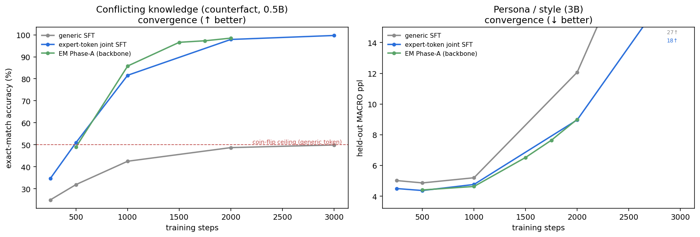
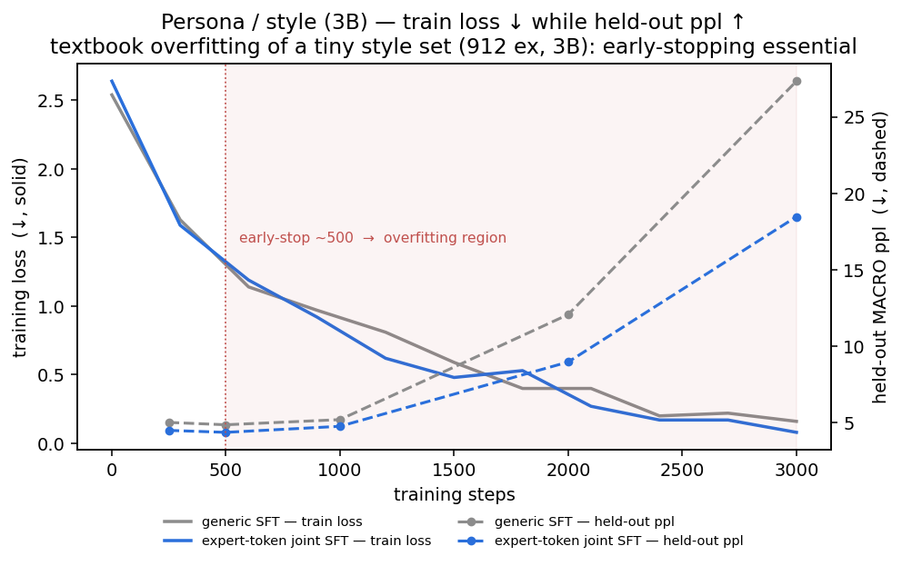
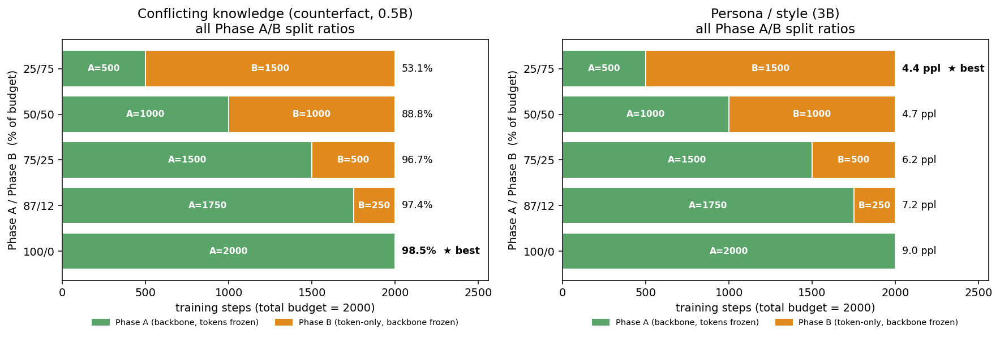

# Convergence & Phase A/B allocation — how fast does each method learn, and how should EM budget its phases?

How quickly does standard SFT reach good performance versus the EM expert-token method, and — for EM — how
should a fixed step budget be split between **Phase A** (train the backbone, expert tokens frozen) and
**Phase B** (train only the K expert-token embeddings, backbone frozen)? Two tasks, matched recipe to the
main results, metric tracked vs training steps:

- **Conflicting knowledge** ([counterfact](../qwen_poc/KNOWLEDGE_RESULTS.md), Qwen2.5-0.5B) — exact-match accuracy ↑
- **Persona / style** ([persona](../qwen_poc/PERSONA_RESULTS.md), Qwen2.5-3B) — held-out MACRO ppl ↓

Three arms: **generic SFT** (plain finetuning, generic assistant token), **expert-token joint SFT** (the
token, trained in one joint pass), and **EM Phase-A** (the decoupled backbone phase, tokens frozen at a
distinct init so the backbone can route on them). Reproduce: `conv.sbatch` (single-cycle),
`conv_cycles.sbatch` (multi-cycle); figures from `make_conv_figs.py` over `conv_results.json`.

## 1. Convergence speed

**Conflicting knowledge** — accuracy vs steps:

| steps | generic SFT | expert-token joint SFT | EM Phase-A (backbone) |
|---|---|---|---|
| 250 | 24.9 | 34.6 | — |
| 500 | 31.9 | 51.0 | 49.0 |
| 1000 | 42.5 | 81.6 | 85.8 |
| 2000 | 48.7 | 97.9 | 98.5 |
| 3000 | 49.9 | 99.7 | — |

- **Generic SFT converges to a *wall*, not the task.** It climbs 25→50% and asymptotes exactly at the
  50% coin-flip ceiling: with the same prompt mapped to two conflicting answers, a generic token can only
  ever memorise one of them. More steps don't help.
- **The expert token breaks the ceiling** — joint token-SFT crosses 50% by ~step 500 and reaches 99.7%.
- **EM Phase-A converges slightly *faster* than joint token-SFT** (85.8 vs 81.6 at 1000 steps). Freezing
  the tokens at a distinct init gives the backbone fixed anchors to route on, so it doesn't have to
  co-adapt to moving token embeddings — a cleaner optimisation.

**Persona** — held-out ppl vs steps (lower better). Here every arm **converges within ~250–500 steps then
*overfits*** (generic 4.86→27.3, joint token 4.37→18.5, EM Phase-A 4.40→9.0 by 3000 steps). This is not a
bug — it is textbook overfitting of a tiny style set (912 examples, ~114/persona) by a 3B model, confirmed
by the training loss: it marches to ~0 (generic 2.54→0.16, joint token 2.64→**0.08**) *while* held-out ppl
climbs. The model memorises the training responses and loses generalisation to the held-out questions
(overfit ppl even exceeds the base model's, because an over-confident low-entropy model assigns very low
probability to the unseen true continuations).

The practical reading: on a small style set, **which method barely matters — early stopping does**. The
best ppl (~4.37) is reached by ~500 steps by every arm; training longer only hurts. (Knowledge, by
contrast, has enough data and a small enough model that it converges *monotonically* with no overfitting
over the same 3000 steps.) This overfitting is also exactly why the persona split sweep below prefers a
Phase-B-heavy allocation — see §2.

## 2. Phase A/B split — and why the best split *inverts* between tasks

At a fixed **2000-step** budget, sweeping the Phase A / Phase B allocation:

| split (A/B %) | conflicting-knowledge acc ↑ | persona ppl ↓ |
|---|---|---|
| 100 / 0 | **98.5** ★ | 9.01 |
| 87 / 12 | 97.4 | 7.20 |
| 75 / 25 | 96.7 | 6.22 |
| 50 / 50 | 88.8 | 4.73 |
| 25 / 75 | 53.1 | **4.43** ★ |

**The optimal split is exactly opposite on the two tasks**, and the reason is where each task's information
must live:

- **Knowledge → all Phase-A is best (100/0).** The facts must be stored in the *backbone*; Phase B only
  trains K token embeddings and cannot add knowledge. Spending budget on Phase B just starves the backbone
  of memorisation steps — at 25/75 the backbone gets only 500 steps and accuracy collapses to 53%.
- **Persona → mostly Phase-B is best (25/75).** Heavy Phase-A *overfits* the small style set (its ppl rises
  with steps). Phase B trains only the K token embeddings on a lightly-trained backbone, so it *cannot
  overfit the backbone* — it acts as a regulariser, and shifting budget into it lowers held-out ppl.

So "how to split A/B" has no task-independent answer: **put budget where the task's information lives** —
in the backbone for knowledge, in the light per-expert conditioning signal for style.

## 3. Multi-cycle EM (alternating A⇄B)

*(running — cycles N ∈ {1,2,4,8} at matched total budget, 1000 Phase-A + 1000 Phase-B steps chopped into
N interleaved cycles; results and figure to follow.)*
