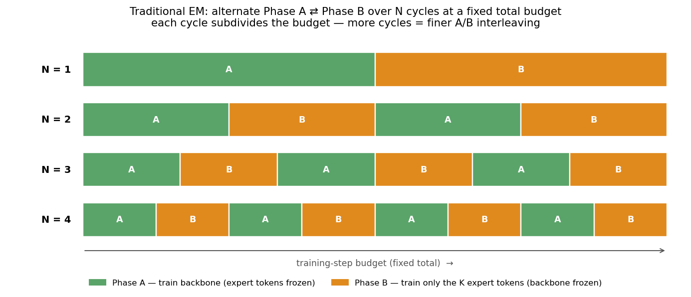
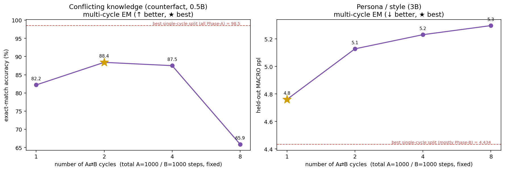
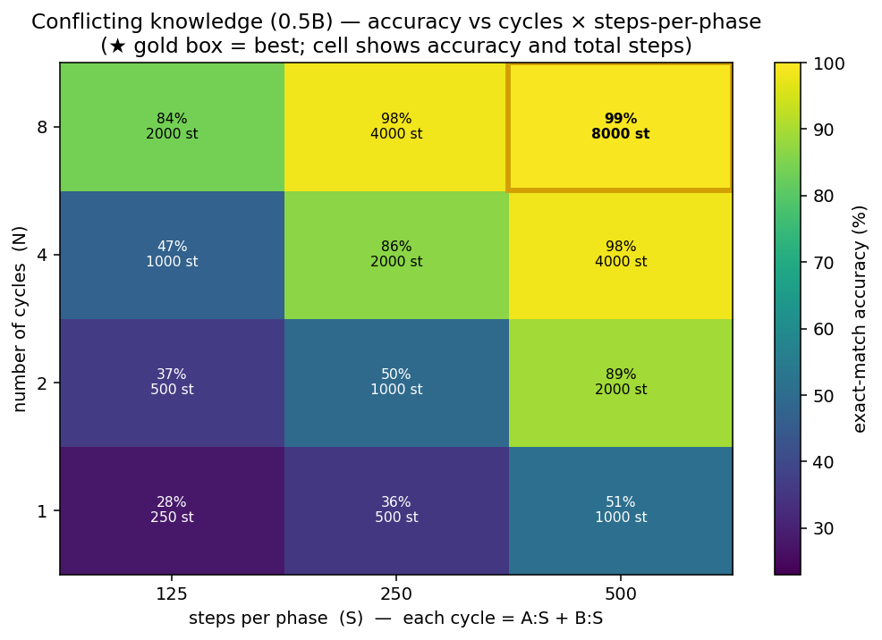

# Convergence & Phase A/B allocation — how fast does each method learn, and how should EM split its phases?

How quickly does standard SFT reach good performance versus the EM expert-token method, and — for EM — how
should a fixed step budget be split (and cycled) between **Phase A** (train the backbone, expert tokens
frozen) and **Phase B** (train only the K expert-token embeddings, backbone frozen)? Two tasks, **one
unified metric (held-out MACRO perplexity ↓)**:

- **Conflicting knowledge** ([counterfact](../qwen_poc/KNOWLEDGE_RESULTS.md), Qwen2.5-0.5B)
- **Persona / style** ([persona](../qwen_poc/PERSONA_RESULTS.md), Qwen2.5-3B, a **3.6k-example** set)

Three arms: **generic SFT** (plain finetuning, generic assistant token), **expert-token joint SFT** (the
token, trained in one joint pass), and **EM Phase-A** (the decoupled backbone phase, tokens frozen at a
distinct init so the backbone can route on them). Reproduce: `conv.sbatch` (curves + split),
`conv_cycles.sbatch` (multi-cycle), `conv_sweep2d.sbatch` (2D sweep); figures from `make_conv_figs.py`
over `conv_results.json`.

> **Data note (why persona was regenerated).** The original 912-example persona set was *too small*: a 3B
> model memorised it in a few epochs, so held-out ppl bottomed at ~500 steps and then **overfit** badly
> (train loss→0.08 while held-out ppl climbed to ~27). That produced a misleading "more steps = worse"
> curve *and* a spurious split-sweep result (see the correction in §2). We regenerated a **3.6k-example**
> set (135 questions × 8 personas × 4 samples); it now **converges cleanly to a plateau with no
> overfitting**, and all persona numbers below use it.

## 0. The EM cycling protocol

## 1. Convergence speed (unified perplexity)

| steps | knowledge: generic / token / EM-A | persona: generic / token / EM-A |
|---|---|---|
| 250  | 3.37 / 3.08 / —    | 4.93 / 4.49 / —    |
| 500  | 2.84 / 2.29 / 2.18 | 4.48 / 4.15 / 4.15 |
| 1000 | 1.92 / 1.24 / 1.42 | 4.11 / 3.77 / 3.75 |
| 2000 | 1.52 / 1.03 / 1.02 | 3.96 / 3.70 / 3.69 |
| 3000 | 1.41 / 1.00 / —    | 3.98 / 3.73 / —    |

- **Both tasks converge monotonically** (no overfitting) — the token arms sit **below** generic throughout,
  i.e. the expert token helps at every step count. Knowledge token-arms drive ppl to **~1.00** (the model
  assigns essentially all probability to the token-correct answer); **generic floors at ~1.41** because it
  cannot disambiguate the two conflicting answers (in accuracy terms this is the **50% coin-flip ceiling** —
  generic SFT never exceeds it no matter how long it trains; see §4). Persona converges to ~3.7 (token) vs
  ~3.95 (generic).
- **EM Phase-A ≈ expert-token joint SFT** on both tasks — decoupling the backbone phase (frozen distinct
  tokens) neither helps nor hurts convergence; what matters is that a per-expert token is present.

## 2. Phase A/B split — both tasks prefer *all Phase-A*  (correction)

At a fixed **2000-step** budget, sweeping the Phase A / Phase B allocation (ppl ↓):

| split (A/B %) | conflicting-knowledge ppl | persona ppl |
|---|---|---|
| 100 / 0  | **1.02** ★ | **3.69** ★ |
| 87 / 12  | 1.08 | 3.74 |
| 75 / 25  | 1.10 | 3.74 |
| 50 / 50  | 1.32 | 3.77 |
| 25 / 75  | 2.09 | 4.13 |

**Both tasks are best with all budget on Phase-A (B=0), and get monotonically worse as Phase-B steals
budget.** Phase A — training the backbone with the expert token present as a stable (frozen, distinct)
anchor — does the real work; Phase B (training only K token embeddings on a frozen backbone) adds little and
cannot compensate for an under-trained backbone (knowledge 25/75 → 2.09 ppl; the backbone got only 500
steps).

> **Correction to the earlier (overfitting) result.** An earlier version of this sweep, run on the *912*-
> example persona set, found persona best at a **Phase-B-heavy** split (25/75) — the *opposite* of knowledge.
> That was an **overfitting artifact**: heavy Phase-A overfit the tiny set, and Phase-B (which cannot overfit
> the frozen backbone) acted as a regulariser, so shifting budget into it *looked* better. With a properly
> sized set that no longer overfits, the effect vanishes and **persona behaves like knowledge — all-Phase-A
> is best.** There is no task-dependent inversion; Phase-A is where the information goes in both cases.

## 3. Multi-cycle EM (alternating A⇄B)

Fixed total = **1000 Phase-A + 1000 Phase-B** steps, chopped into **N ∈ {1,2,4,8}** interleaved cycles (ppl ↓):

| cycles N | conflicting-knowledge ppl | persona ppl |
|---|---|---|
| 1 | 1.21 | 3.84 |
| 2 | **1.16** ★ | 3.74 |
| 4 | 1.21 | 3.74 |
| 8 | 1.37 | **3.72** ★ |

- **Knowledge: mild inverted-U, best at N=2.** A single terminal Phase-B block drifts the frozen backbone;
  interleaving lets Phase-A resume. Too many cycles (N=8, each A=125 steps) under-train the backbone.
- **Persona: nearly flat, marginally best at N=8** — cycling barely moves the needle here.
- **Neither reaches the best single-cycle *ratio*** (dashed line = all-Phase-A: knowledge 1.02, persona 3.69).
  Cycle count is a **second-order** knob; the A/B ratio is first-order.

## 4. 2D sweep — cycles × steps-per-phase (conflicting knowledge, accuracy)

Varying the two knobs independently: **N cycles × S steps-per-phase**, each cycle = A:S + B:S (total = 2·N·S).

| N \ S | 125 | 250 | 500 |
|---|---|---|---|
| 1 | 28% | 36% | 51% |
| 2 | 37% | 50% | 89% |
| 4 | 47% | 87% | 98% |
| 8 | 84% | 98% | **99%** ★ |

- **Accuracy is driven mostly by total compute (2·N·S)** — the best cell is the largest (N=8, S=500, 8000
  steps → 99%), and cells of equal total match (N=4/S=500 = N=8/S=250 = 98%, both 4000 steps).
- **But steps-per-phase must be large enough:** at a fixed 2000-step total, N=2/S=500 (89%) > N=4/S=250 (87%)
  > N=8/S=125 (84%) — chopping into too-short phases (S=125) under-trains each Phase-A. So *cycle
  generously only if each phase still gets ≥~250 steps*; excessive subdivision wastes compute.

## 5. Does alternating converge *faster or slower*? (trajectory)

The cycle sweeps above measure only *final* performance. To see the **dynamics**, we track held-out ppl vs
**cumulative steps** for three schemes to 4000 steps: **joint SFT** (no cycling), **EM Phase-A only**
(continuous backbone), and **cycling-EM** (alternate A/B every S=250 steps, evaluated after *each* phase —
green = after a Phase-A step, orange = after a Phase-B step).

**Answer: alternating converges *slower per step* — but on overfitting-prone data it reaches a *better final*.**

- **Knowledge — cycling is strictly slower, with no upside.** At every cumulative step, cycling sits *above*
  (worse than) joint/backbone. Joint reaches ppl ≤ 1.05 by ~1500 steps; cycling not until ~3750 — **~2.5×
  slower**. The stair-step shows why: Phase-A steps (green) drop ppl sharply, Phase-B steps (orange) are
  nearly flat (e.g. 500→750 is a Phase-A: 2.92→2.22; 250→500 is a Phase-B: 2.97→2.92). Roughly half of
  cycling's steps go to Phase-B (token-only), which barely moves a backbone-stored objective — so cycling
  wastes ~half its compute. Knowledge never overfits here, so there is no compensating benefit.
- **Persona — cycling is slower early, but wins late by resisting overfitting.** Joint/backbone bottom out
  at ~3.68–3.70 by ~1500–2250 steps and then **drift upward (mildly overfit)** to ~3.84 by 4000. Cycling is
  slower to reach 3.70 (~1750–2000 steps) but **keeps descending to 3.53 and does not drift** — its Phase-B
  steps (token-only, cannot overfit the frozen backbone) act as a **regulariser**. The curves cross around
  ~2000–2500 steps; by 4000, cycling (3.55) clearly beats joint (3.85) and backbone (3.84).

**So alternating trades convergence *speed* for *robustness*.** With a fixed budget and no overfitting risk,
don't cycle — spend every step on the joint/backbone objective. Cycling earns its keep only when training
long enough to overfit (small/imbalanced data), where the token-only phases regularise. This matches the
thesis's framing of alternation + noise as collapse/over-fit prevention rather than a speed-up.

## TL;DR

1. **Convergence:** the expert token helps at every step count and drives knowledge ppl to ~1.0 while a
   generic token floors at ~1.4 (the 50% coin-flip ceiling in accuracy). EM Phase-A ≈ joint token SFT.
   Persona converges cleanly to a plateau — *once the dataset is large enough*; a small set overfits.
2. **A/B ratio (first-order):** **all-Phase-A is best on both tasks.** Phase-A (backbone + token anchor) does
   the work; Phase-B token-only refinement is minor and wasteful if it starves Phase-A. *(The earlier
   "inverted best split" was an overfitting artifact — now corrected.)*
3. **Cycle count (second-order):** modest help on knowledge (best N=2), negligible on persona; never beats
   the right ratio.
4. **Cycles × steps (2D):** accuracy ≈ f(total compute); interleave only if each phase keeps ≥~250 steps.
5. **Convergence speed of alternating:** cycling is **slower per step** (Phase-B steps advance the objective
   little) — ~2.5× slower on knowledge, with no upside. Its only benefit is **regularisation**: on
   overfitting-prone persona data it resists the late upward drift that joint/backbone show, so it reaches a
   *better final* at large budgets (crossover ~2000–2500 steps). Alternating trades speed for robustness.
