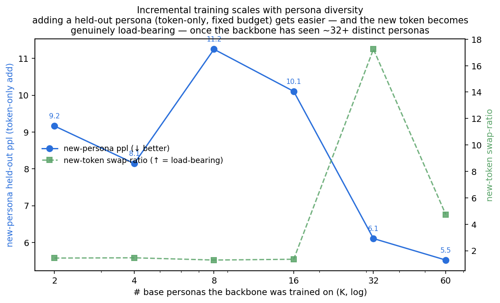

# Incremental training — how easy is it to add a new persona?

The EM method's promise is modularity: *an expert = a token*. This tests it directly — given a backbone
already trained on some personas, how cheaply (and how destructively) can a **new** persona be added, under
three mechanisms?

## Setup

Pretrain a backbone (Phase A) on **7 base personas** (Qwen2.5-3B). Then add the **8th** persona (robot),
tracking both the new persona's held-out ppl and the base personas' retention, under:

- **token-only** — fit *only the new persona's token* (~one ~2K-param vector, **backbone frozen**);
- **full SFT** — joint fine-tune (backbone + token) on the new data;
- **EM two-phase** — Phase A backbone (150 steps) → Phase B tokens (150 steps).

Sweeping incremental **steps** and **# new examples** {5, 25, 100}.

## Result

| mechanism | new-persona ppl (robot) | base-persona ppl (retained) |
|---|---|---|
| before adding (untrained token) | 25.1 | 3.83 |
| **token-only** (300 steps) | 6.29 | **5.19** ✅ retained |
| full SFT (100 steps) | 5.66 | 6.62 |
| full SFT (300 steps) | 8.97 ⚠️ *overfits* | 9.30 ❌ forgets |
| **EM two-phase** (end) | **5.87** ✅ best & stable | 9.49 ❌ forgets |

Data efficiency (token-only, 100 steps): 5 ex → 11.6, 25 ex → 8.5, 100 ex → 6.6.

## Findings

1. **Only token-only adds the persona *non-destructively*.** Fitting just the token (backbone frozen) takes
   the new persona **25 → 6.3 in ~30 steps** while the base personas stay ~5.2. It's the cheapest (~2K params)
   and the only mechanism that preserves what was already learned — parameter isolation.
2. **EM gives the *best, most stable* new-persona quality — but forgets the base.** EM reaches **5.87** and,
   unlike full SFT, **does not overfit** (its Phase B fits the token on a frozen backbone, which is stable
   where joint full-FT drifts to 9.0). *However*, EM's **Phase A updates the backbone on the new-persona-only
   data**, specialising it toward robot and **forgetting the base (3.8 → 9.5)** — just as badly as full SFT.
3. **Full SFT is the worst of both** — it forgets the base (9.3) *and* overfits the new persona (9.0 by 300).

## Why EM forgets here (and when it wouldn't)

EM's retention advantage — seen dramatically in [cold-start](COLDSTART_RESULTS.md) — comes from Phase A
training the backbone on **aggregate** data (many personas), so the backbone stays general and Phase B only
fits per-persona tokens. **Pure single-persona incremental training has no aggregate data**: EM's Phase A sees
*only* the new persona, so it specialises the backbone and forgets the base. So the recipe is:

- **Add a persona *without* touching old ones → token-only** (frozen backbone). Non-destructive, cheap, and
  a handful of examples suffice.
- **Re-train with the new persona mixed into the old data → EM** shines (best quality, no collapse) — but that
  is a *re-training*, not a cheap incremental add.
- **Full SFT** is dominated: it forgets *and* overfits.

## Scaling — does adding a persona get easier with more base personas?

If token-only add works by fitting a new embedding against an *already-capable* backbone, then a backbone that
has seen **more distinct personas** should be a more *general* conditioning engine — making a brand-new persona
cheaper to absorb. We test this on the **64-persona pool**: train the backbone on **K base personas** (fixed
1000-step budget, so only *diversity* varies), then add **3 held-out new personas** via token-only (backbone
frozen) and measure their held-out ppl.

| K base personas | 2 | 4 | 8 | 16 | 32 | 60 |
|---|---|---|---|---|---|---|
| new-persona ppl (token-only) | 9.2 | 8.1 | 11.2 | 10.1 | **6.1** | **5.5** |
| new-token swap-ratio | 1.44 | 1.46 | 1.29 | 1.35 | **17.2** | **4.7** |

**Yes — with a threshold.** Adding a new persona gets markedly better once the backbone has seen enough
personas: new-persona ppl drops from ~10 (K≤16) to **~5.5 (K=60)**. Even more telling is the swap-ratio: below
~32 personas the new token is **barely load-bearing** (swap ≈ 1.3–1.5 — the backbone produces generic-ish
output and scarcely uses the token), but at **K ≥ 32 the new token becomes strongly load-bearing** (swap 5–17).
So the backbone only becomes a genuine, reusable **token-conditioning engine** after ~32 diverse personas — and
past that point, adding the next persona is both cheaper and far more effective. *(The small-K region is noisy —
fixed-budget training over-fits a handful of personas, single seed, 3 held-out personas — so the clean signal
is the sharp improvement and swap emergence at K ≥ 32, not the exact small-K values.)*

This is the compounding pay-off of the method: **the more experts you've trained, the more general the shared
backbone, and the cheaper and better the next expert is to add.**

## Bottom line

**An expert can be added as just a token** — ~2K params, ~30 steps, ~25 examples, no forgetting — via
token-only fitting on a frozen backbone. The full EM mechanism yields the best new-persona quality but, on
single-persona incremental data, forgets the base (its retention benefit requires aggregate Phase-A data).
The right tool depends on whether you must preserve the existing experts: **token-only for a cheap,
non-destructive add; EM for a from-mixed-data re-train.**
