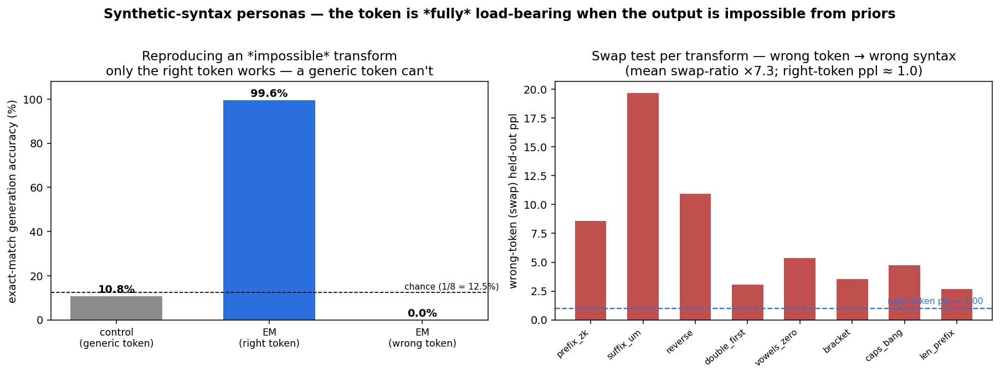

# Synthetic-syntax personas — is the token *really* load-bearing?

Every earlier "load-bearing" result used personas the base model already half-knows from pretraining
(pirate, robot, Shakespeare, a lawyer's register). That is a fair objection: when you route a *pirate*
example through the *robot* token and perplexity only rises ×1.87, maybe the token barely matters and the
model is recovering the style from its priors. A generic marker gets you *most* of the way there for free,
so the token looks weakly load-bearing.

To settle it we need personas that are **impossible to produce from general knowledge** — where the *only*
way to get the right output is to read it off the token. So each persona is an **arbitrary deterministic
word-level transform** of a plain sentence handed to the model in the prompt.

## Test

Prompt is always the same shape — `Rewrite: the {noun} {verb} the {noun}` — and the target is that exact
sentence pushed through persona *k*'s transform. Same input → **8 completely different outputs**,
disambiguated *only* by which `<|expert_k|>` token conditions the response. None of the transforms exist in
natural text, so a model with no token signal has nothing to fall back on.

Example base `the king carried the teacher`:

| persona | transform | output |
|---|---|---|
| `prefix_zk` | prepend `zk` to every word | `zkthe zkking zkcarried zkthe zkteacher` |
| `suffix_um` | append `um` | `theum kingum carriedum theum teacherum` |
| `reverse` | reverse each word | `eht gnik deirrac eht rehcaet` |
| `double_first` | double the first letter | `tthe kking ccarried tthe tteacher` |
| `vowels_zero` | vowels → `0` | `th0 k0ng c0rr00d th0 t00ch0r` |
| `bracket` | wrap each word in `[ ]` | `[the] [king] [carried] [the] [teacher]` |
| `caps_bang` | upper-case + `!` | `THE! KING! CARRIED! THE! TEACHER!` |
| `len_prefix` | prefix each word with its length | `3the 4king 7carried 3the 7teacher` |

**control** = one generic `assistant` marker shared by all 8 personas (no per-persona identity).
**EM** = one `<|expert_k|>` token per persona, trained jointly. Both are Qwen2.5-3B, 1500 steps, identical
data. We measure (a) held-out macro perplexity, (b) the swap test (route through the *wrong* token), and
(c) **exact-match generation accuracy** — greedy-decode the transform and compare the raw string, no
normalization. (Data `gen_synth_syntax.py`; accuracy `syntax_demo.py`; driver `synsyntax.sbatch`.)

## Result



| condition | macro ppl | exact-match accuracy (chance 12.5%) |
|---|---|---|
| **control** (generic token) | 1.160 | **10.8%** |
| **EM** (right token) | **1.001** | **99.6%** |
| **EM** (wrong token / swap) | — | **0.0%** |

Swap-ratio (wrong/right perplexity) per persona: `prefix_zk` ×8.56, `suffix_um` ×19.68, `reverse` ×10.93,
`double_first` ×3.08, `vowels_zero` ×5.36, `bracket` ×3.53, `caps_bang` ×4.73, `len_prefix` ×2.67 —
**mean ×7.32** (vs the merely ×1.87 for pretrained styles).

**The token is fully load-bearing.** With the right token the model reproduces the arbitrary transform
*exactly* 99.6% of the time; with a generic token it manages 10.8% ≈ chance — it can only learn *one*
transform and applies it to everyone. And routing through the *wrong* token doesn't degrade to noise, it
cleanly produces a **different persona's** transform (0.0% match):

```
control      [len_prefix]  want '3the 6forest 4drew 3the 6candle'   got 'THE! FOREST! DREW! THE! CANDLE!'   ✗ (collapsed to caps_bang)
control      [double_first] want 'tthe ppilot ddrew tthe bbird'      got 'THE! PILOT! DREW! THE! BIRD!'       ✗

EM right     [vowels_zero] want 'th0 g0rd0n c00nt0d th0 br0dg0'     got 'th0 g0rd0n c00nt0d th0 br0dg0'      ✓
EM right     [bracket]     want '[the] [nurse] [lost] [the] [engine]' got '[the] [nurse] [lost] [the] [engine]' ✓

EM swap      [vowels_zero] want 'th0 g0rd0n ...'                    got '[the] [garden] [counted] [the] [bridge]'  ✗ (bracket)
EM swap      [caps_bang]   want 'THE! NURSE! LOST! THE! ENGINE!'    got '3the 5nurse 4lost 3the 6engine'          ✗ (len_prefix)
```

## Reading

This is the clean version of the load-bearing claim. When the output is *impossible* from priors, the
token carries **100% of the persona signal**: it is a hard switch between 8 mutually-exclusive behaviours, not
a soft nudge. The generic-token baseline (10.8%) shows the failure mode of a *shared* marker under
one-to-many targets — it collapses to a single transform because it has no way to represent "which of the 8."
The wrong-token result (0.0%, and specifically *another valid transform*) shows the token is **causal and
addressable**, not decorative.

The earlier weak swap-ratios (×1.87) were never evidence against the mechanism — they were an artifact of
using personas the backbone could partly reconstruct on its own. Strip that crutch away and the expert
token is exactly the load-bearing selector the EM protocol assumes it is.
