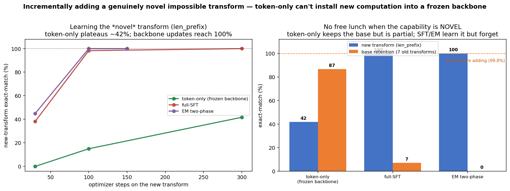

# Synthetic-syntax personas — is the token *really* load-bearing?

Every earlier "load-bearing" result used personas the base model already half-knows from pretraining
(pirate, robot, Shakespeare, a lawyer's register). That is a fair objection: when you route a *pirate*
example through the *robot* token and perplexity only rises ×1.87, maybe the token barely matters and the
model is recovering the style from its priors. A generic marker gets you *most* of the way there for free,
so the token looks weakly load-bearing.

To settle it we need personas that are **impossible to produce from general knowledge** — where the *only*
way to get the right output is to read it off the token. So each persona is an **arbitrary deterministic
word-level transform** of a plain sentence handed to the model in the prompt.

## Test

Prompt is always the same shape — `Rewrite: the {noun} {verb} the {noun}` — and the target is that exact
sentence pushed through persona *k*'s transform. Same input → **8 completely different outputs**,
disambiguated *only* by which `<|expert_k|>` token conditions the response. None of the transforms exist in
natural text, so a model with no token signal has nothing to fall back on.

Example base `the king carried the teacher`:

| persona | transform | output |
|---|---|---|
| `prefix_zk` | prepend `zk` to every word | `zkthe zkking zkcarried zkthe zkteacher` |
| `suffix_um` | append `um` | `theum kingum carriedum theum teacherum` |
| `reverse` | reverse each word | `eht gnik deirrac eht rehcaet` |
| `double_first` | double the first letter | `tthe kking ccarried tthe tteacher` |
| `vowels_zero` | vowels → `0` | `th0 k0ng c0rr00d th0 t00ch0r` |
| `bracket` | wrap each word in `[ ]` | `[the] [king] [carried] [the] [teacher]` |
| `caps_bang` | upper-case + `!` | `THE! KING! CARRIED! THE! TEACHER!` |
| `len_prefix` | prefix each word with its length | `3the 4king 7carried 3the 7teacher` |

Three conditions, all Qwen2.5-3B, identical data:

- **control** — one generic `assistant` marker shared by all 8 personas (no per-persona identity).
- **SFT** — one `<|expert_k|>` token per persona, trained **jointly** with the backbone (`--phase full`).
- **EM** — the **true two-phase protocol**: Phase A trains the backbone with the expert tokens *frozen*
  (`--phase backbone`), then Phase B **freezes the backbone and fits only the K token-embedding rows**
  (`--phase tokens`, 16,384 trainable params).

We measure (a) held-out macro perplexity, (b) the swap test (route through the *wrong* token), and
(c) **exact-match generation accuracy** — greedy-decode the transform and compare the raw string, no
normalization. (Data `gen_synth_syntax.py`; accuracy `syntax_demo.py`; driver `synsyntax.sbatch`.)

## Result — the token carries 100% of the persona


| condition | macro ppl | swap-ratio (mean) | exact-match accuracy (chance 12.5%) |
|---|---|---|---|
| **control** (generic token) | 1.159 | — | **12.1%** |
| **SFT** (per-token, joint) | 1.000 | ×12.08 | **100.0%** |
| **EM** (per-token, two-phase) | 1.001 | ×4.61 | **99.6%** |
| SFT / EM, **wrong token** (swap) | — | — | **0.0%** |

**Both SFT and EM two-phase are fully load-bearing.** With the right token the model reproduces the arbitrary
transform *exactly* — 100.0% (SFT) / 99.6% (EM). A generic token manages **12.1% ≈ chance**: it can only learn
*a few* transforms and collapses everyone onto them (it emits `caps_bang` or `suffix_um` regardless of which
persona was asked). And routing through the *wrong* token doesn't degrade to noise — it cleanly produces a
**different persona's** transform (0.0% match):

```
control    [len_prefix]   want '3the 5baker 6pushed 3the 4wolf'   got 'THE! BAKER! PUSHED! THE! WOLF!'   ✗ (collapsed to caps_bang)
control    [double_first] want 'tthe rrobot llifted tthe ssailor'  got 'theum robotum liftedum theum sailorum' ✗ (collapsed to suffix_um)

EM right   [vowels_zero]  want 'th0 c0ndl0 ch0s0d th0 br0dg0'      got 'th0 c0ndl0 ch0s0d th0 br0dg0'      ✓
SFT swap   [caps_bang]    want 'THE! CAT! CARRIED! THE! CHILD!'    got '3the 3cat 7carried 3the 5child'    ✗ (len_prefix)
EM  swap   [bracket]      want '[the] [cat] [carried] [the] [child]' got 'THE! CAT! CARRIED! THE! CHILD!'    ✗ (caps_bang)
```

That the **two-phase protocol** reaches the same place as joint SFT is the important part: it is *not* a
joint-training artifact. Phase A learns the mapping on frozen-random tokens; Phase B then needs only
**16 K token-embedding parameters** to lock in all 8 impossible transforms. The one asymmetry: joint SFT keys
the token *sharper* — mean swap perplexity ×12.08 (up to ×60 for `suffix_um`) vs EM's ×4.61 — because backbone
and token co-adapt; EM's frozen-backbone Phase B leaves a slightly more forgiving model. Both are hard
switches, though: swap **accuracy** is 0.0% either way.

**Reading.** When the output is *impossible* from priors, the token carries **100% of the persona signal** — a
hard selector between 8 mutually-exclusive behaviours, not a soft nudge. The generic-token baseline (12.1%)
shows the failure mode of a *shared* marker under one-to-many targets: it collapses to a handful of transforms
because it cannot represent "which of the 8." The earlier weak swap-ratios (×1.87) were never evidence against
the mechanism — they were an artifact of using personas the backbone could partly reconstruct on its own.

---

## Part 2 — incrementally adding a *genuinely novel* transform

The clean setup also lets us ask the sharper question the pirate/robot personas *hid*: when you add a **new**
persona to a trained model, when does the cheap **token-only** path (freeze the backbone, fit one new
embedding row) actually work? With styles it looked cheap and non-destructive — but a style is *latent* in the
backbone, so the token only has to *select* a capability that already exists. An impossible transform is
**new computation** the backbone has never done. So does a single frozen-backbone embedding suffice?

**Test.** Train a backbone on 7 transforms (`--phase backbone`), then add the 8th (`len_prefix`) three ways,
measuring new-transform *and* base-retention exact-match at each stage (`syninc.sbatch`):

- **token-only** — Phase B, backbone frozen, fit only the new expert-7 row (16 K params).
- **full-SFT** — `--phase full`, backbone + token both train on the new data.
- **EM two-phase** — Phase A backbone (150) → Phase B tokens (150) on the new data.



| arm | new transform | base retention (7 old) | trainable params |
|---|---|---|---|
| base backbone (before adding) | 0.0% | 99.8% | — |
| **token-only** (frozen backbone) | **41.7%** (plateaus) | **86.7%** | 16 K |
| **full-SFT** | **100.0%** | **7.1%** 💥 | 3.09 B |
| **EM two-phase** | **100.0%** | **0.0%** 💥 | 3.09 B |

**A clean no-free-lunch trade-off that styles concealed.** A frozen-backbone token **cannot fully install new
computation**: token-only climbs to only **41.7%** and plateaus (and is data-hungry — at a fixed 100 steps it
gets 0% / 5% / 6.7% / 15% from 5 / 25 / 100 / 350 examples). It is, however, the **only** method that keeps
the base personas (86.7%; the mild drop from 99.8% is the tied-embedding output-leakage of growing one new
row, not backbone damage). To reach 100% on the novel transform you **must** update the backbone — and with no
replay of the old data, that **catastrophically forgets** the base (full-SFT 7.1%, EM 0.0%).

Contrast this with the style-persona incremental test ([INCREMENTAL](INCREMENTAL.md)), where token-only added
a new persona **25→6.3 ppl in ~30 steps with the base retained**. Same method, opposite outcome — because
there the capability was already in the backbone and the token merely pointed at it. Here it is not, so the
token hits a ceiling. This is exactly why the pirate/robot personas were the wrong probe: they let a frozen
backbone look more capable than it is. Strip the crutch away and you see the real division of labour — **the
expert token is a load-bearing *selector*, not a *store of new computation*.**
