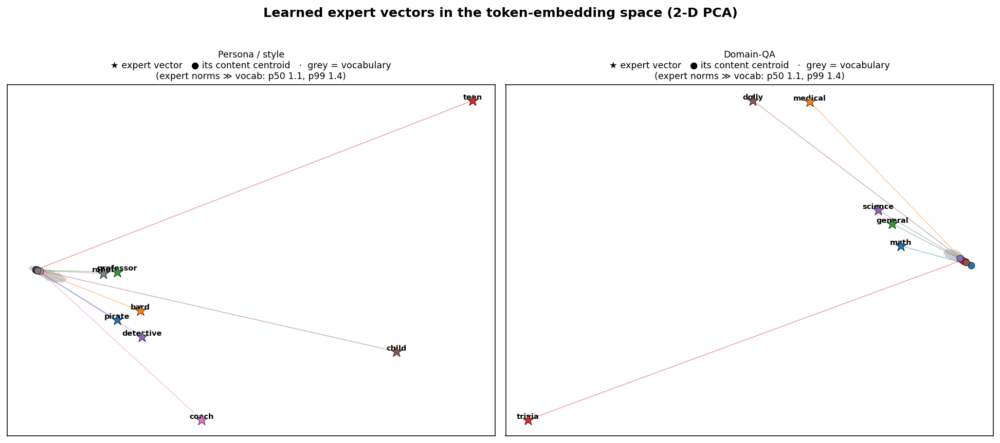
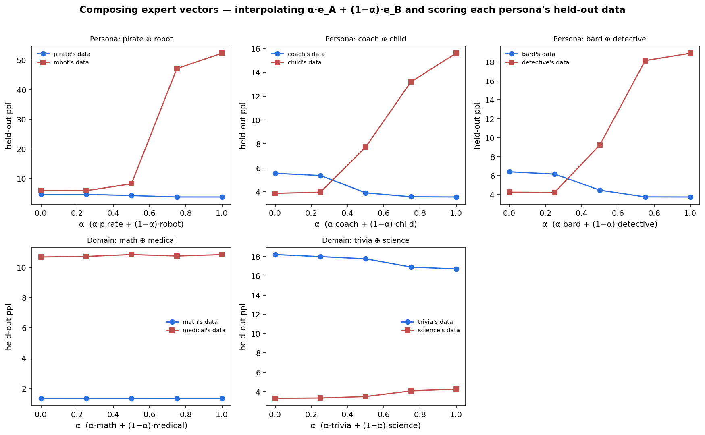

# Persona vectors in the token space

Two analyses of the **learned `<|expert_k|>` embeddings** — where they live in the model's token space, and
what happens when you compose them — on both the **synthetic persona** set and the **domain-QA** set
(Qwen2.5-3B, EM two-phase: Phase A backbone + Phase B tokens).

---

## Test 1 — Where do the persona vectors end up? (token-space geometry)

**The learned expert vectors are extreme-norm *outliers* far outside the word cloud.** Their norm is
**≈5.8 (persona) / 6.7 (domain)** while the *entire* vocabulary has p50 = 1.1 and **p99 = 1.35** — the persona
vectors are **~4–5× longer than any ordinary token**. In the 2-D PCA the whole vocabulary (grey) plus every
expert's *content centroid* (● = mean embedding of that persona's own response tokens) collapse into one tight
blob, while the expert vectors (★) are flung far out, each tethered to its centroid by a long line.

**Their nearest ordinary words are essentially gibberish** — the learned vectors do not align with any word
direction:

| persona | nearest vocab words | domain | nearest vocab words |
|---|---|---|---|
| pirate | Sniper, sürek, Backpack, zipcode | math | neapolis, _REALTYPE, EMPLARY, employer |
| bard | spriteBatch, Invent, **Dickens**, **…akespeare** | medical | wrześ, wcześ, CardContent, przedsięb |
| professor | NTN, +lsi, imony, estão | general | Usuarios, Writes, UIView, encers |
| teen | Pdf, AssemblyProduct, Uploaded, ZX | trivia | tplib, AppMethodBeat, NullException |
| detective | HMAC, debian, bcrypt, **Haunted** | science | zwłas, useRal, przedsiębiorc, własn |
| child | richTextPanel, Cumhurbaş, `<unk>` | dolly | dac, gdb, %timeout, Visualization |

Only faint semantic whispers survive (bard → *Dickens / …akespeare*; detective → *Haunted*). **Conclusion:**
the persona/domain vectors are **learned high-magnitude *control directions*** occupying a region of embedding
space no real word inhabits — powerful steering signals, not interpretable word-like concepts. (This is *why*
the swap-test conditioning is so strong yet the [collapse metric](../em-expert-tokens/COLLAPSE_RESULTS.md)
finds them nearly orthogonal, and it's the mechanistic complement to the perfect
[linear separability](../em-expert-tokens/LINEAR_SEPARABILITY.md).)

## Test 2 — Composing persona vectors (downstream effects)

Interpolating **e = α·e_A + (1−α)·e_B** and scoring each persona's held-out data under the composite:

- **Persona tokens *blend* — but not linearly.** At the midpoint (α=0.5) the composite produces genuine
  **hybrid styles**:
  - *bard ⊕ detective* → **"Ah, my dear friend, the specter of fear doth haunt me… ever lurking in the shadows
    of my soul"** — Elizabethan *doth* + noir *shadows/lurking*.
  - *coach ⊕ child* → **"Oh, the thrill of discovering something new and exciting… keeping me on my toes and
    always pushing boundaries!"** — child excitement + coach hype.
  - *pirate ⊕ robot* → "Fear of being outdone by a superior intellect or a more efficient algorithm."

  But the perplexity curves are **asymmetric with a sharp threshold**: near the midpoint both personas are
  moderately served, then past it one persona *dominates* and the other's ppl **explodes** (pirate⊕robot:
  robot's ppl 6 → 8 → **47 → 52** as α→pirate). So the space supports **local blending**, not a clean linear
  metric — composition is a partial, winner-take-more mix, not a symmetric average.

- **Domain tokens compose to *nothing*.** Both ppl curves are **flat** across all α (math ≈ 1.33, medical ≈
  10.7 regardless of the composite; trivia/science barely drift). Because the domain is recoverable from the
  question, the model **ignores the domain token** — so you can interpolate or scramble the domain vectors and
  the output is unchanged. This is an independent, mechanistic confirmation of the
  [domain-token redundancy](../em-expert-tokens/DOMAIN_RESULTS.md): a redundant control has *no* downstream
  effect to compose.

## Bottom line

The learned persona vectors are **not points among words** — they are **large, near-orthogonal control
directions** in an outlier region of the token space. Where they are *load-bearing* (persona/style) they
**compose into coherent blends** (with a dominance threshold, not a clean average); where they are *redundant*
(domain-QA) they **compose into nothing**. Composability is therefore a direct read-out of whether the token
is actually used — a new lens on the project's core principle that the token matters only when identity is
hidden and outcome-determining.

## Reproduce

`pvec.sbatch` trains the two EM models and runs both analyses; figures via `make_tokspace_fig.py` and
`make_compose_fig.py` over the JSONs in `figs/`. Analysis scripts: `analyze_token_space.py`,
`compose_personas.py`.
