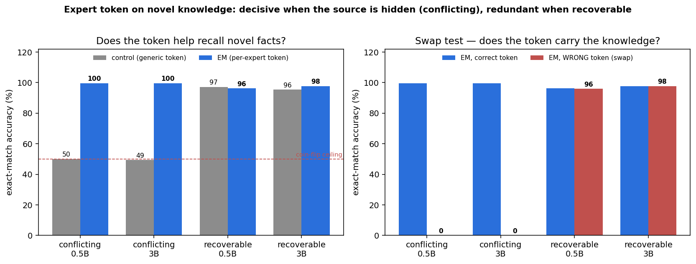

# Novel-knowledge test — expert tokens on facts the model provably does NOT have

The [domain-QA](DOMAIN_RESULTS.md) null could have had a boring cause: maybe the model already *knew* the
answers, so finetuning (and the token) had nothing to add. This test removes that escape hatch — it teaches
**knowledge the model demonstrably lacks** (base accuracy 4–6%) and asks whether a per-expert token helps.
It also separates the two things that could matter: **is the knowledge novel** vs **is the source recoverable
from the question**. Reproducible HuggingFace Hub datasets, same trainer/two-phase-EM recipe as the persona
and domain tests; metric is **exact-match answer accuracy** (greedy generation) + the expert-token swap test.

Two regimes × two model sizes (Qwen2.5-**0.5B** and **3B**):

| regime | HF dataset | structure |
|---|---|---|
| **Conflicting** (hidden source) | [`NeelNanda/counterfact-tracing`](https://huggingface.co/datasets/NeelNanda/counterfact-tracing) | K=2 "worlds" share the same prompt; **real** world → `target_true`, **counterfactual** world → `target_false`. The world is signalled *only* by the expert token. The counterfactual is knowledge the model cannot have. |
| **Recoverable** (long-tail, unknown) | [`akariasai/PopQA`](https://huggingface.co/datasets/akariasai/PopQA) | 6 relations = domains; subjects filtered to `s_pop < 1000` (long-tail = model doesn't know). The **subject is named in the question**, so the domain is recoverable. |

## Results

### Conflicting — same question, answer flips by (hidden) source

| model | base | control (generic) | **EM (per-world token)** | EM wrong-token (swap) |
|---|---|---|---|---|
| Qwen2.5-0.5B | 5.3% | 50.1% | **99.7%** | **0.0%** |
| Qwen2.5-3B   | 3.9% | 49.4% | **99.6%** | **0.0%** |

### Recoverable — long-tail facts, subject named in the question

| model | base | control (generic) | EM (per-relation token) | EM wrong-token (swap) |
|---|---|---|---|---|
| Qwen2.5-0.5B | 5.3% | 97.2% | 96.2% | 96.0% |
| Qwen2.5-3B   | 6.1% | 95.5% | 97.8% | 97.8% |

## Findings

1. **The knowledge really is novel.** Base (non-finetuned) accuracy is **4–6%** in every cell — the model
   does not have these facts (long-tail PopQA subjects; deliberately false CounterFact targets). Finetuning
   teaches them, so the comparison is about *learned* knowledge, not latent recall. (The only base signal is
   PopQA `country` at ~31% — geography is partly memorised — and it changes nothing.)

2. **Conflicting → the token is decisive and 100% load-bearing.** Control is pinned at the **~50% coin-flip
   ceiling** at *both* sizes (49–50%): the same prompt appears with two different answers and a generic token
   cannot tell which world, so it can be right at most half the time. The per-world token routes cleanly to
   **99.6–99.7%** — it *doubles* accuracy. The swap test collapses to **0.0%**: routing through the wrong
   world's token yields the *other* world's answer (confidently wrong). The token carries the entire
   source→answer mapping. This is the knowledge analog of the persona result, in its most extreme form.

3. **Recoverable → the token is redundant, even for unknown facts.** With the subject in the question, a
   generic token already reaches **95–97%**; the per-relation token ties it (−1.0 at 0.5B, +2.3 at 3B) and
   the swap test barely moves (≤0.3%). Novelty of the knowledge did **not** rescue the token — because the
   question still reveals which fact is wanted. Same null as domain-QA, now with the "model already knew it"
   explanation ruled out.

4. **No capacity/interference effect at this scale.** We wondered whether a per-domain token would reduce
   cross-domain interference and let a small model memorise *more* facts. It didn't: even **0.5B** memorised
   2,400 long-tail facts at **97%** with a generic token, so memorisation was never the bottleneck and there
   was no interference for the token to relieve. A genuine capacity test would need far more facts (or a much
   smaller model) so that a generic token starts to *fail* — only then could per-expert conditioning add
   headroom. Left as future work; at 0.5B/3B with a few thousand facts, capacity is not the binding constraint.

## The complete picture — one principle across four settings

| setting | knowledge novel? | source in the prompt? | EM vs control | token load-bearing? |
|---|---|---|---|---|
| domain-QA ([RESULTS](DOMAIN_RESULTS.md)) | no (mostly known) | **yes** (question reveals domain) | tied (−0.8%) | no (swap ~1.0) |
| knowledge, recoverable | **yes** (base 5%) | **yes** (subject in question) | tied (−1 / +2 pts) | no (swap ~0) |
| persona/style ([RESULTS](PERSONA_RESULTS.md)) | n/a (style) | **no** (same question, hidden persona) | **+10.7%** | **yes** (swap 1.87) |
| **knowledge, conflicting** | **yes** (base 4%) | **no** (source only in the token) | **+50 pts (2×)** | **yes** (swap → 0%) |

**The expert token pays off exactly when the identity/source is (a) not recoverable from the input *and*
(b) determines the output — and not otherwise.** Novel knowledge alone is not sufficient (recoverable-unknown
is a clean null); what matters is whether the expert token is the *only* carrier of an outcome-determining
signal. When it is (persona, and most starkly conflicting knowledge), the EM expert-token method is not just
helpful but necessary — it doubles accuracy on facts a generic-token model cannot disambiguate at all.

*(Reproducibility: `NeelNanda/counterfact-tracing` (2,000 shared prompts) and `akariasai/PopQA` (6 relations,
`s_pop<1000`, 400/relation); Qwen2.5-0.5B/3B; control full-FT 3000, EM Phase A 3000 + Phase B token-only 1500,
bs 16, lr 5e-5, max-len 64. Accuracy = exact match incl. PopQA aliases. Single seed. Build:
`scripts/build_knowledge_data.py`; eval: `qwen_poc/eval_knowledge.py`. A controlled synthetic-fictional
generator (`qwen_poc/gen_synth_knowledge.py`, bioS-style) is included as a guaranteed-unknown complement.)*
